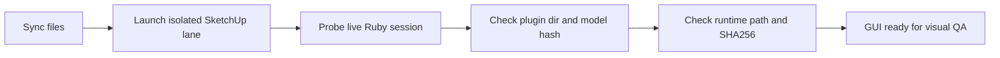

# SketchUp Runtime Guard

[](https://github.com/LaiHu2002/sketchup-skill/actions/workflows/validate.yml)

**Suggested GitHub description:** Codex skill for isolated SketchUp plugin launches and runtime identity proof before visual QA.

> "The bridge responds" is not evidence. Prove which SketchUp process, plugin directory, model, and native runtime are actually live.

SketchUp Runtime Guard is a small, agent-friendly method for launching and validating SketchUp plugin development sessions without trusting stale processes, shared plugin directories, old bridge ports, or cached runtime binaries.

The core idea is simple: before a visual QA result is accepted, prove which SketchUp process, plugin directory, model, bridge endpoint, and local runtime binary are actually live.

This repository is intentionally small. It is a reusable SketchUp plugin validation skill and reference checklist, not a project-specific deployment system.

## Before And After

| Before | After |
| --- | --- |
| Bridge is reachable. Maybe it is the right SketchUp session. | SketchUp PID, plugin dir, model path, bridge port, runtime path, and runtime SHA256 are all checked. |
| Files were copied, so the build is probably deployed. | File sync and live runtime identity are reported as separate states. |
| A screenshot failed, so the plugin might be broken. | Environment failures, dirty runtime identity, and actual plugin failures are separated. |

## Quick Demo

Validate the included synthetic identity and ledger:

```bash
ruby scripts/validate_runtime_identity.rb \
  --identity examples/runtime-identity.example.json \
  --ledger examples/session-ledger.example.json \
  --quiet
```

Expected result:

```text
PASS
```

Generate a local identity JSON from explicit paths or environment variables:

```bash
ruby scripts/probe_sketchup_identity.rb \
  --lane-id lane-local \
  --plugin-name ExamplePlugin \
  --plugin-dir /tmp/sketchup-runtime-guard/lane-local/Plugins/ExamplePlugin \
  --model-path /tmp/sketchup-runtime-guard/lane-local/models/validation.skp \
  --bridge-port 49152 \
  --runtime-path /tmp/sketchup-runtime-guard/lane-local/Plugins/ExamplePlugin/lib/example_runtime \
  --expected-sha256 ABCDEF0123456789ABCDEF0123456789ABCDEF0123456789ABCDEF0123456789
```

## Why This Exists

SketchUp plugin development often mixes desktop state, Ruby plugin loading, HtmlDialog frontends, native helper processes, file caches, bridge servers, and manual visual checks. That makes it easy to believe that a new build is being tested while SketchUp is still running an old plugin copy or an old native runtime.

This project turns that situation into a repeatable checklist:

- Launch each validation run in its own lane.
- Use an isolated SketchUp user home when possible.
- Bind each run to a dedicated plugin directory, model file, bridge port, and artifact directory.
- Query SketchUp from inside the live session to confirm the plugin identity.
- Hash the runtime binary and compare it to the expected manifest value.
- Treat bridge connectivity as necessary but not sufficient.
- Clean up only the processes and files owned by the current lane.

## What Counts As Proven

Use three separate result levels:

- `files_synced`: files were copied into a target plugin directory.
- `runtime_identity_proven`: the live SketchUp session reports the expected plugin path, model path, bridge port, runtime path, and runtime hash.
- `gui_ready_for_visual_qa`: runtime identity is proven and the requested model/dialog/view is open for human inspection.

Do not collapse these into one "deployed" status. Copying files does not prove that SketchUp is using them.

## Repository Contents

- `skills/sketchup-runtime-guard/SKILL.md`: a Codex skill for planning and verifying isolated SketchUp plugin validation runs.
- `skills/sketchup-runtime-guard/agents/openai.yaml`: optional UI metadata for skill lists.
- `scripts/probe_sketchup_identity.rb`: emits a normalized runtime identity report from explicit paths, environment variables, or a live SketchUp Ruby context.
- `scripts/validate_runtime_identity.rb`: validates an identity report, optionally against a session ledger.
- `examples/runtime-identity.example.json`: a sanitized runtime identity report.
- `examples/session-ledger.example.json`: a sanitized lane/session ledger entry.
- `SECURITY.md`: publication and diagnostic safety notes.
- `LICENSE`: MIT license.

## Install As A Codex Skill

Copy or install the skill folder into your Codex skills directory:

```text
skills/sketchup-runtime-guard/
```

Then invoke it explicitly with:

```text
Use $sketchup-runtime-guard to validate this SketchUp plugin session before visual QA.
```

The skill is written to stay vendor-neutral. Adapt the placeholder plugin name, runtime binary name, manifest schema, and bridge protocol to your own SketchUp plugin.

## Flow



## Suggested macOS Lane Shape

Prefer launching the SketchUp executable directly with an isolated home and explicit model path:

```bash
CFFIXED_USER_HOME="$RUN_ROOT/home" \
HOME="$RUN_ROOT/home" \
APPDATA="$RUN_ROOT/home" \
TMPDIR="$RUN_ROOT/tmp" \
PLUGIN_GUARD_BRIDGE_PORT="$PORT" \
"/Applications/SketchUp 2026/SketchUp.app/Contents/MacOS/SketchUp" \
"$RUN_ROOT/models/validation.skp"
```

Do not treat `open -n SketchUp.app` as proof of isolation. On macOS, SketchUp can still load plugins from the real user application support directory unless the process environment and plugin tree are proven from inside SketchUp.

## Minimum Runtime Identity Fields

A useful identity report should include:

- SketchUp PID and version.
- Plugin root and plugin directory, as reported by live Ruby code.
- Environment values relevant to isolation.
- Active model path and model hash.
- Bridge host and port.
- Runtime PID, path, actual SHA256, and expected SHA256.
- Manifest path and source/build identifier, if available.
- Probe timestamp and lane ID.

See `examples/runtime-identity.example.json` for a compact example.

## Scripts

### `probe_sketchup_identity.rb`

Use this when you need a normalized JSON report. It can run in plain Ruby with explicit paths, or inside SketchUp Ruby where `Sketchup.active_model` and `Sketchup.version` are available.

Important inputs:

- `--plugin-dir`
- `--model-path`
- `--bridge-port`
- `--runtime-path`
- `--expected-sha256` or `--manifest`

It does not launch SketchUp or claim GUI success. It only records identity facts.

### `validate_runtime_identity.rb`

Use this as a small gate before accepting evidence:

```bash
ruby scripts/validate_runtime_identity.rb --identity runtime-identity.json --ledger session-ledger.json
```

It fails when required fields are missing, the runtime hash does not match, the runtime path is outside the plugin directory, or the identity report disagrees with the ledger.

Use `--quiet` when a CI-like script only needs `PASS` or `FAIL`.

## Validation

Run the local checks:

```bash
ruby -c scripts/probe_sketchup_identity.rb
ruby -c scripts/validate_runtime_identity.rb
ruby scripts/validate_runtime_identity.rb \
  --identity examples/runtime-identity.example.json \
  --ledger examples/session-ledger.example.json \
  --quiet
```

## Safety Rules

- Never kill every SketchUp process by default. Only stop processes registered to the current lane.
- Never use a shared bridge port as evidence unless it is tied back to the current SketchUp PID and plugin directory.
- Never publish diagnostic bundles that contain real customer models, private plugin paths, credentials, tokens, machine names, or internal release locations.
- Treat a present-but-invalid runtime manifest as a hard failure, not as permission to fall back silently.
- If the live runtime path or hash does not match the expected value, the visual QA result is invalid.

## Suggested Topics

For GitHub repository topics, consider:

```text
sketchup
sketchup-plugin
codex-skill
runtime-validation
plugin-development
ruby
htmldialog
visual-qa
```

## Status

This first public version captures the validation model, a Codex skill, and two small Ruby scripts. The scripts are intentionally generic: adapt the plugin name, runtime binary name, manifest schema, and bridge protocol to your own SketchUp plugin.

## License

MIT.
